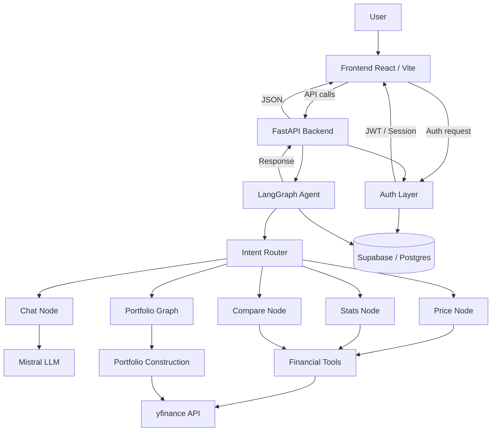
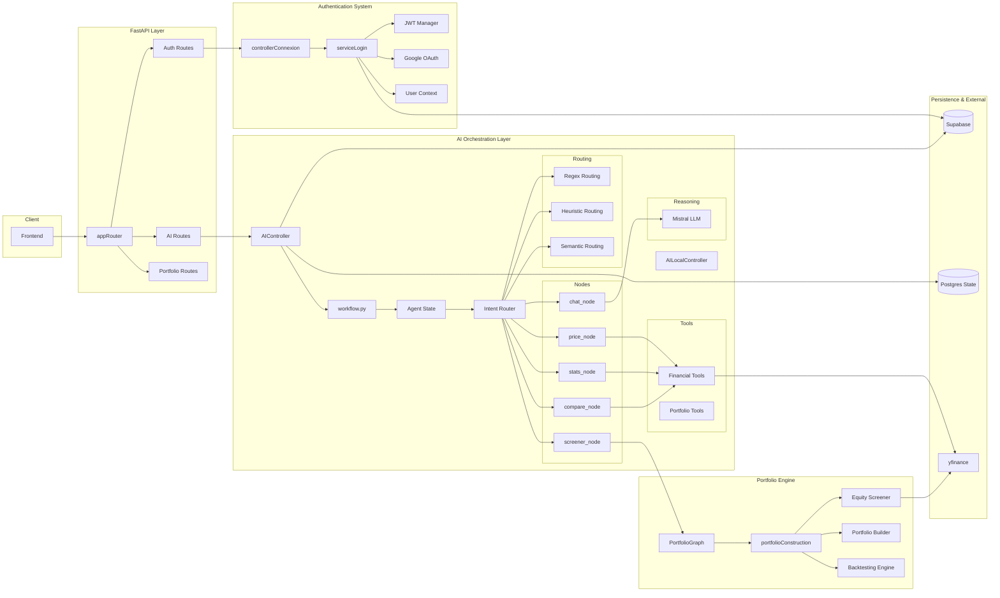
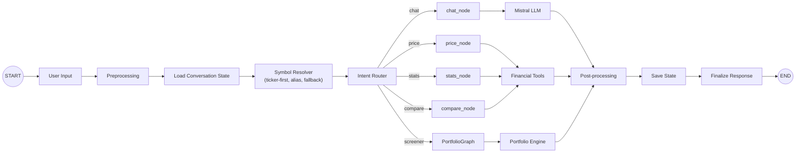
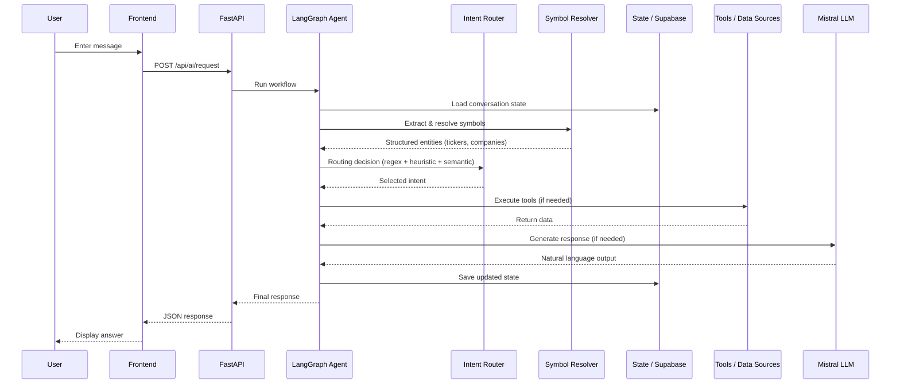
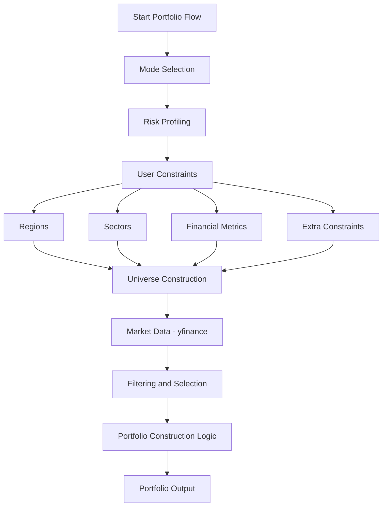
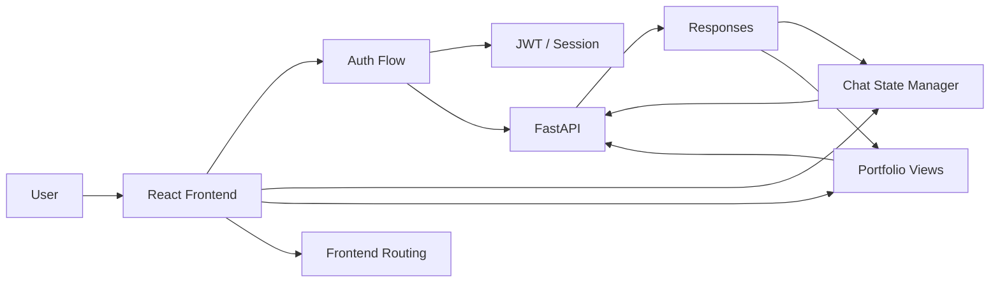

<div align="center">

# KyberIA

### Assistant financier intelligent + constructeur de portefeuille piloté par graphes + interface web full‑stack

<p align="center">
  
  
  
  
  
  
  
</p>

<p align="center">
  <strong>Un projet qui combine orchestration IA, outils financiers, construction de portefeuille et expérience web moderne.</strong>
</p>

</div>

---

## Table des matières

- [1. Vision du projet](#1-vision-du-projet)
- [2. Ce que fait KyberIA](#2-ce-que-fait-kyberia)
- [3. Architecture globale](#3-architecture-globale)
- [4. Vue experte du backend](#4-vue-experte-du-backend)
- [5. Résolution d’entités financières et routage intelligent](#5-résolution-dentités-financières-et-routage-intelligent)
- [6. Portfolio Constructor](#6-portfolio-constructor)
- [7. Frontend](#7-frontend)
- [8. Structure du repository](#8-structure-du-repository)
- [9. Stack technique](#9-stack-technique)
- [10. Installation et lancement](#10-installation-et-lancement)
- [11. Variables d'environnement](#11-variables-denvironnement)
- [12. Tests](#12-tests)
- [13. Avertissement](#13-avertissement)

---

## 1. Vision du projet

**KyberIA** est une application full-stack pensée comme un **assistant financier intelligent** capable de :

- comprendre des requêtes utilisateur en langage naturel,
- router automatiquement la demande vers le bon moteur métier,
- répondre à des questions de marché,
- lancer un parcours de **construction de portefeuille** guidé,
- fournir une expérience conversationnelle persistante,
- s’intégrer dans une interface web moderne.

L’objectif n’est pas seulement de répondre à une question financière, mais de construire une **plateforme cohérente** où :

- le **backend** orchestre l’intelligence métier,
- le **moteur IA** choisit dynamiquement la bonne action,
- le **portfolio constructor** transforme des contraintes utilisateur en logique de portefeuille,
- le **frontend** rend l’ensemble exploitable de façon claire et fluide.

En pratique, le projet se situe à l’intersection de quatre briques :

1. **API backend FastAPI**
2. **Agent IA orchestré par LangGraph**
3. **Module de construction de portefeuille**
4. **Frontend React / Vite**

---

## 2. Ce que fait KyberIA

### Fonctionnalités principales

#### Assistant financier conversationnel
L’utilisateur peut discuter avec l’application comme avec un assistant capable d’interpréter plusieurs types d’intentions financières.

#### Routage intelligent des intentions
Le moteur IA décide si une requête correspond à :
- une conversation générale,
- une demande de prix,
- une demande de statistiques,
- une comparaison,
- un besoin de screener / construction de portefeuille.

#### Gestion de chats
Le backend gère :
- la création de nouveaux chats,
- la récupération d’un historique,
- la suppression,
- la persistance des métadonnées.

#### Authentification
Le projet inclut une authentification via **Google OAuth**, puis une gestion de session avec **JWT** et cookie côté backend.

#### Portfolio Constructor
L’utilisateur peut entrer dans un parcours guidé de construction de portefeuille basé sur :
- le niveau de risque,
- les préférences géographiques,
- les secteurs,
- les indicateurs,
- d’autres contraintes dynamiques générées par l’agent.

#### Frontend moderne
Le frontend sert d’interface utilisateur pour :
- la connexion,
- la navigation,
- les interactions de chat,
- l’accès à l’écosystème KyberIA.

---

## 3. Architecture globale

### Vue d’ensemble



### Lecture de l’architecture

- **Frontend** : point d’entrée utilisateur.
- **FastAPI** : expose les routes métier.
- **Auth layer** : gère l’identité utilisateur.
- **LangGraph** : orchestre les nœuds de raisonnement et d’action.
- **Router** : décide quel chemin exécuter.
- **Portfolio constructor** : sous-système spécialisé dans la logique de construction de portefeuille.
- **Supabase / Postgres** : persistence applicative et checkpoints.

---

## 4. Vue experte du backend

Le backend est le cœur structurel du projet. Il ne sert pas seulement des routes HTTP : il relie l’auth, la mémoire conversationnelle, le graphe IA et les modules financiers.

### Diagramme expert du backend



### Rôle des grandes briques backend

#### `appRouter.py`
Point d’entrée principal de l’API.  
Il centralise les routes exposées au frontend.

#### Couche d’authentification
Elle gère :
- la redirection OAuth,
- le callback Google,
- la création / vérification de session,
- l’identification de l’utilisateur.

#### Couche IA
Elle prend en charge :
- l’orchestration de workflow,
- le routage d’intention,
- l’appel au LLM,
- la mémoire conversationnelle,
- la persistance des chats.

#### Couche portfolio
Elle porte la logique métier spécialisée :
- screening d’univers,
- construction,
- optimisation / préparation,
- backtest.

---

## 5. Résolution d’entités financières et routage intelligent

Le moteur IA est un des points forts du projet.  
L’application n’est pas un simple chatbot : elle fonctionne comme un **agent orchestré**.

### Workflow IA



### Principe du router

Le routeur combine plusieurs approches complémentaires pour interpréter les requêtes utilisateur de manière robuste et déterministe.

#### 1. Extraction et résolution de symboles (structured-first)
Une étape déterministe extrait et résout les entités financières directement depuis le texte utilisateur :

- priorité aux **tickers explicites** (exact match),
- puis **noms de sociétés / alias / formes canoniques**,
- fallback structuré depuis le texte si le LLM ne détecte rien,
- consolidation des candidats pour éviter les sous-entités ambiguës.

Cette étape est **dataset-driven** (basée sur les données Yahoo enrichies) et ne dépend pas uniquement du LLM.

#### 2. Routage par regex
Extraction structurée d’éléments utiles :
- tickers,
- sociétés,
- période,
- indices textuels.

#### 3. Routage heuristique
Détection par règles métier de formulations typiques :
- demandes de prix,
- demandes de statistiques,
- demandes de comparaison,
- requêtes orientées portefeuille.

#### 4. Routage sémantique
Classification plus souple du message à l’aide d’un modèle de représentation / similarité sémantique.

### Pourquoi ce design est intéressant

Ce design hybride permet :
- une **résolution fiable des entités financières** avant toute logique sémantique,
- plus de robustesse qu’un simple classifieur,
- une meilleure interprétation de la langue naturelle,
- une séparation claire entre **compréhension (routing)** et **exécution (tools)**,
- une architecture extensible pour ajouter de nouveaux outils ou stratégies de résolution.

### Cycle de vie d’un message (end-to-end)



### Résolution de symboles

Le système de résolution de symboles suit une cascade robuste :

1. **Ticker-first**
   - match exact sur les tickers (ex: AAPL, MSFT)
   - résolution immédiate sans ambiguïté

2. **Name / alias-first**
   - correspondance sur :
     - noms longs (longName),
     - noms courts,
     - alias externes (fichier dédié),
     - formes dérivées normalisées

3. **Structured fallback**
   - extraction directe depuis le texte utilisateur
   - indépendante du LLM

4. **Semantic fallback (last resort)**
   - embeddings utilisés uniquement en dernier recours

Un mécanisme de **consolidation des candidats** permet :
- d’éviter les collisions (ex: BNP vs BNP Paribas),
- de supprimer les sous-entités inutiles,
- de préserver les cas de comparaison multi-entreprises.

### Données utilisées pour la résolution

Le résolveur s’appuie sur plusieurs fichiers de données :

- `company_enriched.pickle` : dataset principal des entreprises (Yahoo Finance)
- `company_aliases.json` : alias externes et noms alternatifs
- `company_embeddings.pt` : représentations vectorielles pour fallback sémantique

Ce système est conçu pour fonctionner à l’échelle de **l’ensemble des entreprises Yahoo Finance**, sans hardcoding spécifique.

---

## 6. Portfolio Constructor

Le **Portfolio Constructor** est l’une des parties les plus différenciantes du projet. Il est déclenché dynamiquement par l’agent IA
lorsque l’intention utilisateur correspond à un besoin de construction de portefeuille.

### Objectif

Transformer une conversation utilisateur en un cadre exploitable pour construire un portefeuille cohérent. 

### Idée générale

Au lieu de demander directement une liste d’actifs, l’application mène un parcours structuré :
- compréhension du mode de construction,
- qualification du profil,
- collecte de contraintes,
- génération / filtrage de l’univers,
- logique de portefeuille.

### Vue fonctionnelle



### Deux niveaux dans le système portefeuille

#### Niveau 1 — `PortfolioGraph`
C’est le **sous-graphe conversationnel** :
- il guide l’utilisateur,
- il gère les étapes,
- il décide quelles informations collecter,
- il structure l’état du parcours.

#### Niveau 2 — `portfolioConstruction`
C’est le **moteur métier** :
- construction d’univers,
- screener,
- logique portefeuille,
- backtest.

### Pourquoi cette séparation est bonne

Elle sépare :
- **l’expérience utilisateur** (conversation, collecte, guidage)
- de **la logique financière** (univers, portefeuille, simulation)

Cela rend le projet :
- plus maintenable,
- plus extensible,
- plus professionnel dans sa conception.

---

## 7. Frontend

Le frontend est une composante à part entière du projet.  
Il ne faut pas le voir comme un simple habillage, mais comme la couche qui rend l’écosystème exploitable.

### Rôle du frontend

Le frontend sert à :

- initier l’authentification,
- piloter les échanges avec le backend,
- afficher l’expérience de chat,
- intégrer les parcours utilisateur,
- préparer l’exposition des modules portefeuille.

### Position dans l’écosystème



### Ce qu’apporte le frontend au produit

- une interface moderne,
- un couplage propre avec l’API,
- un point d’accès unique à l’auth et à l’agent,
- la base nécessaire pour industrialiser le produit.

### Pourquoi il faut le documenter dans le README

Le projet n’est pas uniquement un backend IA.  
Le frontend fait partie de la proposition de valeur globale, donc il mérite une vraie place dans la documentation :

- architecture applicative,
- rôle produit,
- commandes de lancement,
- lien avec le backend,
- flux d’authentification.

---

## 8. Structure du repository

```text
KyberIA/
│
├── backend/
│   ├── appRouter.py
│   ├── ai/
│   │   ├── agent/
│   │   ├── controller/
│   │   ├── core/
│   │   └── tools/
│   ├── authentification/
│   └── portfolioConstruction/
│
├── frontend/
│
├── tests_backend/
│
├── requirements.txt
├── pytest.ini
├── start.sh
└── README.md
```

### Lecture rapide de l’arborescence

- `backend/` : logique serveur, agent, auth, portefeuille.
- `frontend/` : interface web.
- `tests_backend/` : validation côté backend.
- `start.sh` : script de lancement combiné.
- `requirements.txt` : dépendances Python.
- `pytest.ini` : configuration Pytest.

---

## 9. Stack technique

## Backend
- **Python**
- **FastAPI**
- **Uvicorn**
- **LangGraph**
- **LangChain / Mistral**
- **Supabase**
- **psycopg / Postgres**
- **yfinance**

## IA / routage
- **LangGraph**
- **Sentence Transformers**
- **scikit-learn**
- **routage heuristique + regex + sémantique**

## Frontend
- **React**
- **Vite**
- **MUI**

## Tests
- **pytest**
- **pytest-asyncio**

---

## 10. Installation et lancement

## Installation backend

```bash
python -m venv .venv
source .venv/bin/activate
pip install -r requirements.txt
```

---

## Installation frontend

```bash
cd frontend
npm install
cd ..
```

---

## Lancement complet

```bash
chmod +x start.sh
./start.sh
```

Ce script lance :
- le backend FastAPI,
- le frontend React/Vite.

---

## 11. Variables d'environnement

Créer un fichier `.env` à la racine du projet.

### LLM / IA
```env
MISTRAL_API_KEY=your_key
MISTRAL_MODEL=your_model
LLM_TEMPERATURE=0.2
```

### Supabase / base / checkpoints
```env
SUPABASE_DIRECT_LINK=your_postgres_connection
SUPABASE_URL=your_supabase_url
SUPABASE_SERVICE_KEY=your_supabase_service_key
```

### Auth Google + JWT
```env
GOOGLE_CLIENT_ID=your_google_client_id
GOOGLE_CLIENT_SECRET=your_google_client_secret
GOOGLE_REDIRECT_URI=http://localhost:8000/api/auth/callback
JWT_SECRET=your_jwt_secret
```

---

## 12. Tests

Lancer les tests backend avec :

```bash
pytest -q
```

### Objectifs des tests
- valider le comportement backend,
- mesurer le routage,
- vérifier le comportement global de l’agent dans un contexte local,
- valider la robustesse de la résolution de symboles sur un large univers (≈1000+ entreprises),
- tester les cas ambigus (collisions de shortTicker, noms similaires, alias).

---

## 13. Avertissement

KyberIA est un projet d’ingénierie logicielle et d’assistance financière.  
Il ne doit pas être interprété comme un service de conseil en investissement.

Les réponses, constructions de portefeuille et analyses produites par l’application doivent être considérées comme :
- des résultats techniques,
- des aides à l’analyse,
- des points d’appui exploratoires.

---

<div align="center">

### KyberIA — Intelligent Financial Assistant & Portfolio Construction Platform

</div>
